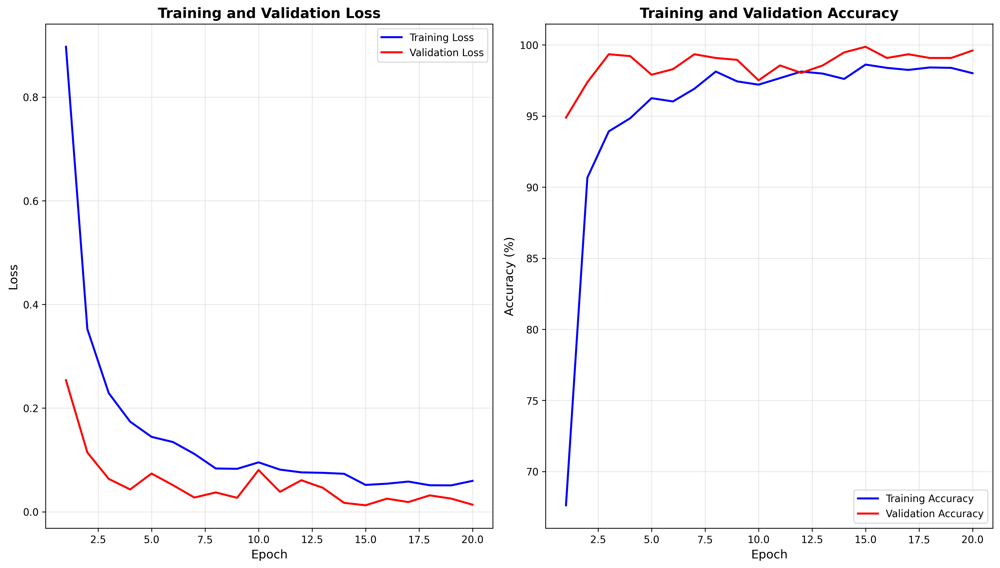
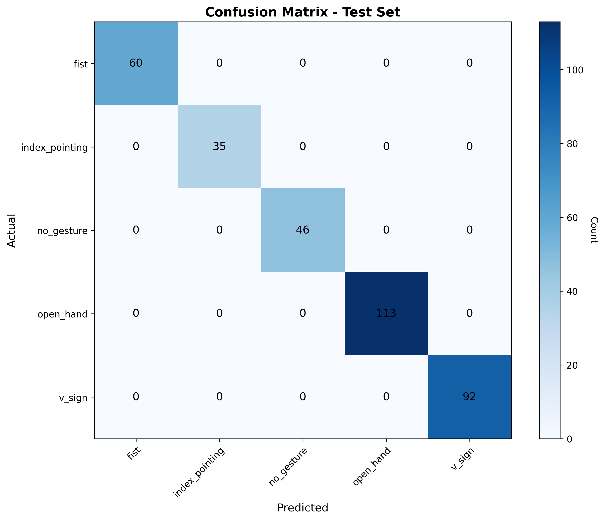

# Hand Gesture Game Control using a custom CNN built from scratch with a custom dataset

Real-time hand gesture recognition system for controlling racing games using deep learning and computer vision.


## Overview

This project implements an end-to-end machine learning pipeline using, mainly a custom, from scratch, Convolutional Neural Network and a custom self-procured dataset for real-time hand gesture recognition, enabling touchless game control through a webcam. The system uses MediaPipe for hand tracking and a custom CNN for gesture classification, achieving **99.5% accuracy** on a diverse dataset.

## Features

- **5 Gesture Recognition**: Open hand, fist, V-sign, index pointing, and no gesture
- **Real-time Inference**: <50ms latency per frame with GPU acceleration
- **Robust Detection**: Works across different users, lighting conditions, and backgrounds
- **Configurable Controls**: YAML-based configuration for easy customization
- **Visual Feedback**: Live display with gesture detection, FPS counter, and control indicators

## Gestures & Controls

| Gesture | Game Action | Key Binding |
|---------|-------------|-------------|
| ✋ Open hand | Accelerate | W |
| ✊ Fist | Brake/Reverse | S |
| ✌️ V-sign | Drift | S |
| ☝️ Index finger | Nitro | N |
| 👈👉 Hand position | Steer | A/D |

## Performance

- **Test Accuracy**: 99.46%
- **Training Dataset**: 4,983 images across 5 gestures
- **Inference Time**: ~30-40ms per frame on Apple M-series GPU
- **FPS**: 25-35 in real-time operation

### Per-Class Accuracy
- Fist: 100%
- Index Pointing: 100%
- Open Hand: 99.4%
- V-Sign: 99.4%
- No Gesture: 98.4%

## Architecture

### CNN Model
- **Input**: 224×224 RGB images
- **Architecture**: 3 convolutional blocks (32→64→128 filters)
- **Regularization**: Batch normalization + Dropout (0.5)
- **Parameters**: 12.9M trainable parameters
- **Output**: 5-class softmax classification

### Pipeline
```
Camera Feed → MediaPipe Hand Detection → Bounding Box Extraction 
→ CNN Classification → Keyboard Control → Game Input
```

## Installation

### Prerequisites
- Python 3.8+
- Webcam
- macOS/Windows/Linux

### Setup

1. **Clone repository**
```bash
git clone https://github.com/arush-3009/real-time-hand-gesture-game-controller.git
cd real-time-hand-gesture-game-controller
```

2. **Create virtual environment**
```bash
python -m venv venv
source venv/bin/activate  # On Windows: venv\Scripts\activate
```

3. **Install dependencies**
```bash
pip install -r requirements.txt
```

## Usage

### Run Game Control
```bash
python main.py
```
- Press **Q** to quit

### Train Model
```bash
python -m ml.train
```

### Evaluate Model
```bash
python -m ml.evaluate
```

### Collect Training Data
```bash
python -m data.collect_data
```

## Project Structure
```
Project_asphalt_hand_control_CNN/
├── ml/                          # Machine learning module
│   ├── config.py               # ML hyperparameters & paths
│   ├── model.py                # CNN architecture
│   ├── train.py                # Training pipeline
│   ├── evaluate.py             # Evaluation & metrics
│   └── inference.py            # Real-time prediction
├── src/                         # Game control module
│   ├── camera.py               # Webcam interface
│   ├── tracking.py             # MediaPipe hand detection
│   ├── gestures.py             # Gesture classification
│   ├── keyboard_input.py       # Keyboard control
│   ├── display.py              # Visual feedback
│   ├── game_control.py         # Main controller
│   └── config.py               # App configuration
├── data/                        # Dataset
│   ├── dataset/
│   │   ├── raw/               # Original images
│   │   └── processed/         # Train/val/test split
│   ├── collect_data.py        # Data collection script
│   └── split_data.py          # Dataset splitting
├── models/                      # Saved models
│   └── gesture_cnn_best.pth   # Trained model weights
├── results/                     # Training outputs
│   ├── confusion_matrix.png
│   └── training_curves.png
├── config.yml                   # App settings
├── main.py                      # Entry point
└── README.md
```

## Configuration

Edit `config.yml` to customize:
```yaml
camera:
  width: 640
  height: 480

gestures:
  left_threshold: 0.4          # Steering sensitivity
  right_threshold: 0.6
  smoothing_threshold: 3       # Control stability
  bounding_box_padding: 15     # Hand crop padding

display:
  mode: "webcam"               # "webcam" or "info_only"
  show_fps: true
  show_gesture_table: true
```

## Technical Details

### Data Augmentation
- Random rotation (±15°)
- Horizontal flip (50% probability)
- Random crop with padding
- **Color jitter** (brightness ±40%, contrast ±40%)

### Training Configuration
- **Optimizer**: Adam (lr=0.001)
- **Loss**: Cross-entropy
- **Batch size**: 64
- **Epochs**: 20
- **Device**: GPU (MPS/CUDA) with CPU fallback

### Model Checkpointing
- Saves best model based on validation accuracy
- Early stopping after 10 epochs without improvement

## Results

### Training Curves


### Confusion Matrix


## Planned/Ongoing Improvements

- [ ] Multi-hand gesture support
- [ ] Transfer learning (MobileNetV3) for mobile deployment
- [ ] Temporal smoothing with LSTM
- [ ] Web app deployment (Streamlit/Flask)
- [ ] Support for additional games/applications
- [ ] Voice feedback integration
- [ ] Gesture customization UI

## Troubleshooting

### Low FPS
- Reduce camera resolution in `config.yml`
- Ensure GPU acceleration is enabled
- Close background applications

### Gestures Not Detected
- Increase lighting
- Move hand closer to camera
- Lower `MODEL_DETECTION_CONFIDENCE` in `ml/config.py`
- Reduce `bounding_box_padding` in `config.yml`

### Model Not Found
- Run `python -m ml.train` to train model
- Ensure `models/gesture_cnn_best.pth` exists

## Technologies Used

- **PyTorch**: Deep learning framework
- **MediaPipe**: Hand tracking and landmark detection
- **OpenCV**: Image processing and video capture
- **scikit-learn**: Evaluation metrics
- **pynput**: Keyboard control simulation
- **matplotlib**: Visualization
- **pandas**: Data analysis

## Contributing

Contributions welcome! Please:
1. Fork the repository
2. Create feature branch (`git checkout -b feature/AmazingFeature`)
3. Commit changes (`git commit -m 'Add AmazingFeature'`)
4. Push to branch (`git push origin feature/AmazingFeature`)
5. Open Pull Request

## License

This project is licensed under the MIT License - see the [LICENSE](LICENSE) file for details.

## Author

**Arush Handa**
- GitHub: [@arush-3009](https://github.com/arush-3009)
- LinkedIn: [Arush Handa](https://www.linkedin.com/in/arush-handa-30b6a7241/)
- Email: a4handa@uwaterloo.ca

